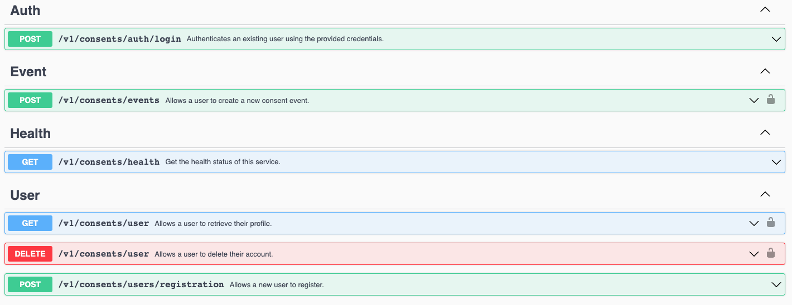
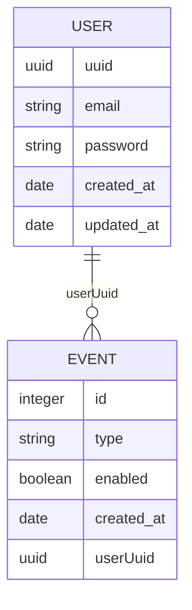

# Granite

This is a monorepo for granite, an online consent management platform.

## Getting Started

1. Clone the repo: `git clone git@github.com:nicolaspearson/granite.git`
2. Install [Yarn2](https://yarnpkg.com/getting-started/install)
3. Switch to the latest stable version: `yarn set version stable`
4. Install dependencies: `yarn install`

Optionally install [yamllint](https://yamllint.readthedocs.io/).

### Configure Visual Studio Code

1. Download and install [Visual Studio Code](https://code.visualstudio.com)
2. Open the project
3. Install the extensions listed in `.vscode/extensions.json`
4. Switch to the `granite` workspace by opening `.vscode/granite.code-workspace`, and clicking on
   the "Open Workspace" button.

## Project Overview

This is a monorepo project, which means it allows multiple packages (workspaces) in a single
repository. The packages are divided into the following domains:

- `backend`: Backend packages and support packages.
- `frontend`: Frontend packages and support packages.
- `shared`: Support packages that are common between the `frontend` and `backend` packages.

### Tech Stack

This repository uses:

- [`docker`](https://www.docker.com)
- [`expressjs`](https://expressjs.com)
- [`nestjs`](https://nestjs.com)
- [`typescript`](https://www.typescriptlang.org)
- [`yarn2`](https://yarnpkg.com)

### Configuration Files

- `.dockerignore`: ignores the listed files and directories when using the docker COPY command.
- `.eslintignore`: ignores the listed files and directories when running ESLint.
- `.eslintrc.js`: defines the global ESLint configuration.
- `.pnp.cjs`: automatically generated by Yarn2.
- `.prettierignore`: ignores the listed files and directories when running Prettier.
- `.prettierrc`: defines the global Prettier configuration.
- `.yarnrc.yaml`: yarn2 configuration.
  - [fix dependencies with package extensions](https://yarnpkg.com/getting-started/migration#fix-dependencies-with-packageextensions)
- `docker-compose.yaml`: defines docker image for local testing
- `jest.config.js`: defines the global Jest configuration which is inherited by each package.
- `tsconfig.json`: defines the global TypeScript configuration which is inherited by each package.

### Development Tools

- **commitlint**: to enforce the [conventional commit](https://www.conventionalcommits.org/) style.
- **husky**: commit hooks that run commitlint, yarn and prettier to ensure quality before pushing.
- **eslint**: JavaScript and TypeScript linter.
- **prettier**: code auto formatter.

### Yarn2

This monorepo takes advantage of new Yarn 2 features, e.g. Plug 'n Play and zero-installs,
to prevent traditional problems caused by such setups.

Project configuration:

- Common `devDependencies` to **all** packages are defined as `dependencies`
  in the root `package.json`.
- Common scripts are defined in the root `package.json`, all packages can inherit them.
- Each package has its own specific `scripts`, `dependencies` and `devDependencies`.
- There is no `node_modules` directory, dependencies are committed to the repo via `.yarn/cache`.
  This greatly speeds up CI builds when the monorepo starts to grow.

## `svc-consents`

The preference / consent management service. Unit and integration test coverage for this package is
locked in at 100%.

### Building, Running, and Testing the Package

```bash
# Build the package
yarn workspace svc-consents build

# Lint the package
yarn workspace svc-consents lint

# Start the service in dev mode
yarn workspace svc-consents start:dev

# Execute the unit tests for the package
yarn workspace svc-consents test:unit

# Execute the integration tests for the package
yarn workspace svc-consents test:integration
```

The project can also be built and started using docker:

```bash
# Build the package using docker
yarn workspace svc-consents docker:build

# Build and start the package using docker
yarn workspace svc-consents docker:start

# Attach to the docker logs for the package
yarn workspace svc-consents docker:logs
```

### Continuous Integration

There are 4 jobs in the continuous integration workflow for this package
(`.github/workflows/backend.svc-consents.yaml`):

1. Build and lint the package.
2. Run the unit tests.
3. Run the integration tests.
4. Build the docker image and upload it to the Github docker registry (only on the `main` branch).

### Swagger

Swagger documentation is served on [localhost](http://localhost:3000/docs/consents/#/). Requests
can be executed directly from the Swagger user interface. The example documentation contains valid
fixtures that are automatically populated on application start-up.



### REST API

This directory contains a REST client file that allows developers to execute REST calls from
visual studio code. Alternatively use the Swagger user interface.

- Install the REST client extension for vscode:
  [`humao.rest-client`](https://github.com/Huachao/vscode-restclient.git).
- Execute requests from the `consents.http` file.

### API Architecture

The section serves to describe the `RESTful` endpoints, and in some cases why the implementation
diverges from the requirements in the
[code challenge](https://github.com/didomi/challenges/tree/master/backend).

I implemented an authentication flow to ensure that only an authorized user is allowed to interact
with their data. There are pre-populated fixtures in the database which can be used for testing
purposes:

```json
{
  "email": "john.doe@example.com",
  "password": "secret"
}
```

#### Improvements

A list of possible improvements:

- Check password strength in the password validator.
- Use `redis` to whitelist JWT's (described in the delete endpoint section below).
- Add architecture diagrams.
- Document `authentication`, `event`, and `user` flows using `mermaid.js`.

#### POST `/v1/consents/users/registration` (unauthenticated)

Description:

Registers a new user in the database. An email address and password must be provided.

> A user accepts only one required field (email) that must be a valid email address and unique. If
> any of the requirements are not satisfied, the API must return a 422 response.

I deviated from the requirement above, and instead return a `400` due to the reasons documented
below.

Exceptions:

- A `400` is returned if an invalid email address is provided or the password contains illegal
  characters, is too short or too long.
- A `400` is also returned if the user already exists. This was done in order to avoid user
  enumeration attacks on an unauthenticated endpoint.
- A `500` is returned if an unexpected error occurs.

Sample response:

```json
{
  "id": "343c6ac5-2b72-4c41-a9eb-28f5ae49af80",
  "email": "john.doe@example.com",
  "consents": []
}
```

#### POST `/v1/consents/auth/login` (unauthenticated)

Description:

Authenticates a user and returns a JWT which can be used to interact with the authenticated
endpoints.

Exceptions:

- A `400` is returned if an invalid email address is provided or the password contains illegal
  characters, is too short or too long.
- A `404` is returned if the user does not exist.
- A `404` is also returned if the user provides invalid credentials. This was done in order to
  avoid user enumeration attacks on an unauthenticated endpoint.
- A `500` is returned if an unexpected error occurs.

Sample response:

```json
{
  "token": "<REDACTED>"
}
```

#### POST `/v1/consents/events` (authenticated)

Description:

Creates a new consent event for the authenticated user.

Exceptions:

- A `400` is returned if the request payload does not pass the validation rules. The `id` must be
  either `email_notifications` or `sms_notifications`, and enabled must be a `boolean`.
- A `401` is returned if the user does not provide a valid JWT in the authorization header.
- A `422` is returned if the user does not exist.
- A `500` is returned if an unexpected error occurs.

Sample response:

```json
{
  "user": {
    "id": "343c6ac5-2b72-4c41-a9eb-28f5ae49af80"
  },
  "consents": [
    {
      "id": "email_notifications",
      "enabled": true
    }
  ]
}
```

#### GET `/v1/consents/health` (unauthenticated)

Description:

A generic health check endpoint that indicates whether or not the service is `up`.

Exceptions:

None.

Sample response:

```json
{
  "status": "OK"
}
```

#### GET `/v1/consents/user` (authenticated)

Description:

Retrieves the authenticated user's profile. It was assumed that only the latest version of each
event type should be included, e.g. if a user has 5 `email_notifications`, and 2
`sms_notifications` events only the last entry for each will be returned.

Exceptions:

- A `401` is returned if the user does not provide a valid JWT in the authorization header.
- A `404` is returned if the user does not exist.
- A `500` is returned if an unexpected error occurs.

Sample response:

```json
{
  "id": "343c6ac5-2b72-4c41-a9eb-28f5ae49af80",
  "email": "john.doe@example.com",
  "consents": [
    {
      "id": "email_notifications",
      "enabled": true
    }
  ]
}
```

#### DELETE `/v1/consents/user` (authenticated)

Description:

Deletes the authenticated user from the database.

After the user is deleted their JWT will still be valid. As an improvement I would use `redis` to
whitelist JWT's, when a user is deleted their JWT's would be removed from the whitelist. An
additional step would be added to the `JwtAuthGuard` that will do a lookup in `redis` to ensure the
provided JWT `exists` before allowing a request to proceed.

Exceptions:

- A `401` is returned if the user does not provide a valid JWT in the authorization header.
- A `500` is returned if an unexpected error occurs.

Sample response:

Returns a `204` if the user was successfully deleted.

### Database

This package uses TypeORM and PostgreSQL.

#### Migrations

To generate the missing migrations TypeORM applies existing migrations, and use the diff between
the database schema and the TypeORM entities to create a migration file.

```sh
# Replace <MigrationName> with a descriptive name for the generated migration
yarn workspace svc-consents db:migration:generate:missing <MigrationName>
```

#### Structure

The database structure can be seen below (documented using `mermaid.js`):


