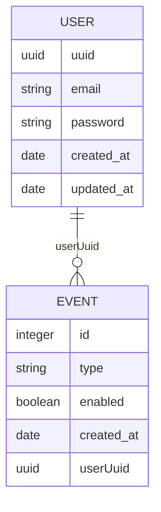

# svc-consents

The consent management service.

## Getting Started

```bash
# Make a copy of the .env.example
cp packages/backend/svc-consents/.env.example packages/backend/svc-consents/.env

# Build the package
yarn workspace svc-consents build

# Lint the package
yarn workspace svc-consents lint

# Start the service in dev mode
yarn workspace svc-consents start:dev

# Execute the unit tests for the package
yarn workspace svc-consents test:unit

# Execute the integration tests for the package
yarn workspace svc-consents test:integration
```

Swagger documentation is served on [localhost](http://localhost:3000/docs/consents/#/).

## Database

### Migrations

To generate the missing migrations TypeORM applies existing migrations, and use the diff between
the database schema and the TypeORM entities to create a migration file.

```sh
# Replace <MigrationName> with a descriptive name for the generated migration
yarn workspace svc-consents db:migration:generate:missing <MigrationName>
```

### Structure

The database structure can be seen below:


